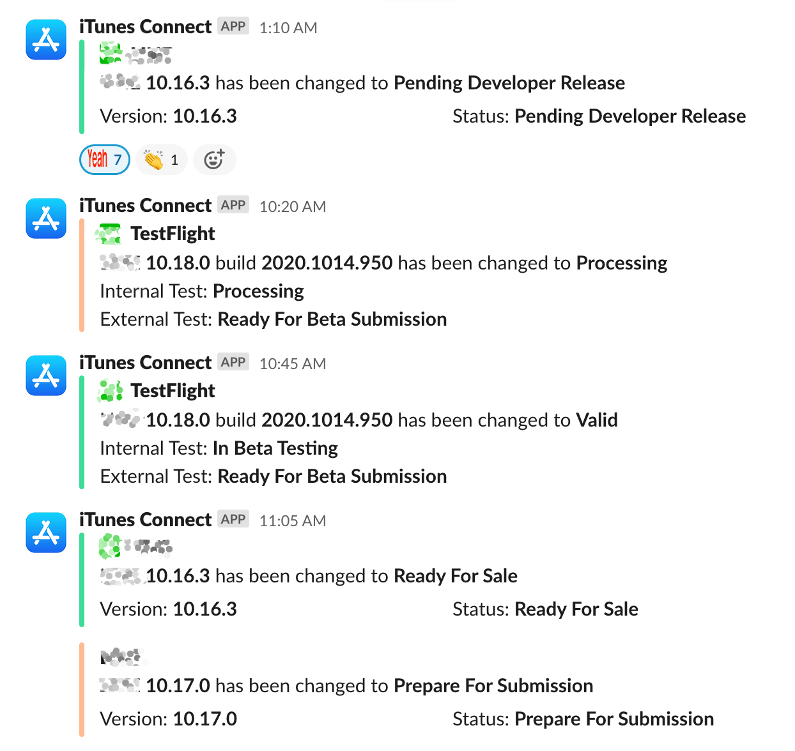
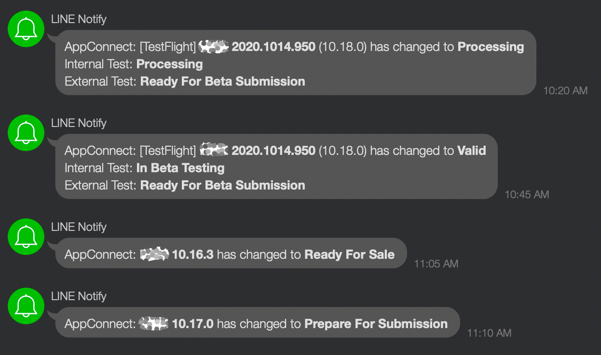

# AppStoreConnect Notifier

This script collects status and metric data of app from AppStore Connect and dispatches them to the notifiers(LINE, Slack, or CSV files even).

## Features

- Support collecting status of both App and TestFlight build
- Support collecting metric datas from Apps
- Share status change via Slack and LINE(or any customize notifier)
- Supoprt to configure mutiple notifiers for multiple Apps and TestFilght builds
- Generate CSV report for metric datas
- Pure TypeScript and no fastlane required.




## Configure

Create `config.json` (refer to `config.json.example`) and configure API, apps, and notifiers.

### API

This script supports two type of API.

#### AppStoreConnect

1. Refer to [Creating API Keys for App Store Connect API](https://developer.apple.com/documentation/appstoreconnectapi/creating_api_keys_for_app_store_connect_api) to generate a private key.
2. Fill the `API` section in `config.json`.

```json
"API": {
  "type": "api/app-store-connect-api",
  "constructor": [ "issuer_id", "key_id", "private_key_file_path" ]
},
```

#### Iris

Iris API is used in AppStore Connect web site and is **unoffical**.

Fill the `API` section ` config.json`.

```json
"API": {
  "type": "api/iris-connect-api",
  "constructor": [ "username", "password" ]
},
```

### Notifiers

This script supports three type of notifiers and all notifiers are configured in `notifiers` section in `config.json.
You can config multiple notifiers but they much have different names.

#### Console Notifier

Console notifier logs all the changed in console.

```json
{
  "name": "Sample Console Notifier",
  "class": "notifier/console-notifier",
  "constructor": []
},
```

#### Slack Notifier

Slack notifier sends app status changes to a specific channel of slack.

```json
{
  "name": "Sample Slack Notifier",
  "class": "notifier/slack-notifier",
  "constructor": [ "slack_token", "slack_channel_name" ]
}
```

#### LINE Notifier

LINE notifier sends app status changes via [LINE Notify](https://notify-bot.line.me).

```json
{
  "name": "Sample LINE Notifier",
  "class": "notifier/line-notifier",
  "constructor": [ "line_notify_token" ]
},
```

#### CSV Notifier

CSV notifier collects app metric data and generate CSV files from them.

```json
{
  "name": "Sample CSV Notifier",
  "class": "notifier/csv-notifier",
  "constructor": [ "directory of CSV files" ]
}
```

### App

Apps are configured in `apps` section of `config.json`.
App config needs a `bundleId` and a list of notifier names.

```json
{
  "bundleId": "app_bundle",
  "notifiers": ["Notifier Name 1", "Notifier Name 2"]
},
```

### TestFlight Build

TestFlights are configured in `testflight` section of `config.json`.
The parameters of TestFlight build are the same as `App`.

```json
{
  "bundleId": "app_bundle",
  "notifiers": ["Notifier Name 1", "Notifier Name 2"]
},
```

### Schedule

This script can schedule update jobs.
The schedule is configured in `schedule` section of `config.json`. The parameter applies the syntax of cron job.

Example:
The config below will run update every minute.

```json
"schedule": "0 * * * * *"
```

## Run

### Update data

`npm start update`

### Update data without any notifications

`npm start migrate`

### Start scheduling

`npm start schedule`

### Schedule with PM2

`pm2 start process.json`

You may want to run `pm2 save` to save the status.

## Custom Notifier

You can make any custom notifier to meet your needs.

The notifier interface is defined in `src/notifier/notifier.ts`.  

```typescript
export interface Notifier {
  notify(appVersion: AppVersion): Promise<void>
  notifyTestFlightBuild(build: TestFlightBuild): Promise<void>
}
```

You can create a new notifier class that implements this interface and export it as default ([example](https://github.com/waynezhang/app-store-connect-notifier/blob/master/src/notifier/console-notifier.ts)).  

Then configure it in `config.json` like below:

```
{
  "notifiers": [
    {
      "name": "Awesome Notifier",
      "class": "awesome-class-here",
      "constructor": [ "all-the-arguments-for-constructor" ]
    },
    ...
  ],
  ...
}
```
